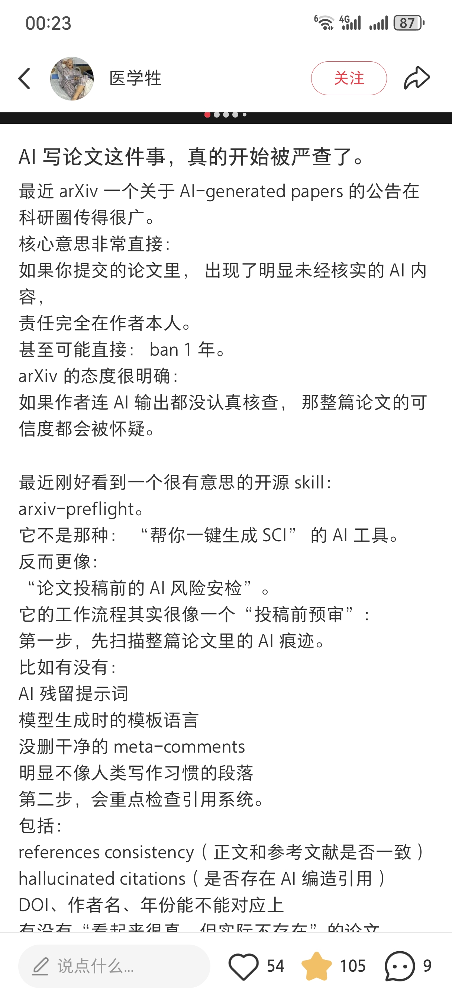

# 3\. FastWrite

项目地址： https://github\.com/FastR\-D/FastWrite

多人协作：

## 功能

1. Agent编辑

2. 逐段精修

3. GPT审稿

### 长期愿景

基本Agent平台，支持接入各类Skills，例如：管理文献，做知识库。以及画图Skill。

以及更新idea，论文讨论Skill。

基本功能：

- 整体架构修改：basic tool，类似于Cursor那样多文件修改。

- 单句修改润色

基于AI\-Scientist去修改：

https://github\.com/SakanaAI/AI\-Scientist

https://sakana\.ai/ai\-scientist\-nature/

https://arxiv\.org/pdf/2408\.06292

写作Agent：

https://github\.com/SakanaAI/AI\-Scientist/blob/main/ai\_scientist/perform\_writeup\.py\#L412

---

预期效果：

导入本地或者github项目，在本地按段落编辑，暂时不考虑多人协作。使用浏览器WASM版latex engine动态本地编译论文。主要为了解决overleaf需要频繁的将段落复制到llm chat里面进行修改，再复制回来，并且没法让LLM读前后章节背景，需要手动维持prompt以及contex，十分麻烦。

因此想设计AI写作工具实现如下功能：

- 思路讨论：idea讨论，某一节写作思路讨论。讨论完可让AI去修改，类似于planning模式。

- 段落初稿修改：帮助结合前后文，去检查内容是否合理，然后基于模糊的用户思路，生成初稿。

- 每句话精修：反复调整句子结构，改的更简洁流畅。并检查语法和句法、拼写错误。

编辑交互：

LLM能力有限，目前是逐段修改。

## 功能开发与优化

### Paper import （done）

brower本地目录，是否需要copy文件到项目目录？后期如果考虑服务器部署，就需要上传。

所以建议还是copy到项目目录。

Github import: 支持从github拉Paper（需要配置github token），以及push Paper到github

### AI Panel （hy）

### Agent Mode 

@郑钦烽

@肖修齐

https://openai\.com/index/introducing\-prism/

需求说明:

- 单独的一个paper聊天界面，需要看摆放在哪里

- 可以在这个界面提需求，让AI给修改建议，AI会自动总结论文内容，到一个Paper\.md之类的memory文档

- 可以给修改建议，去自动修改一些位置，可选择是否接收。可锁住已搞定的章节

### WASM Latex编译

@谢子洋

后端下载latex需要的资源包，确保web wasm latex能编译常见paper，以及用户import了罕见包，能自己去ctan下载

### 同步方案

思路\-1: 借助Overelaf/Github来同步

> 直接api调用，先pull，再push？
> 
> 缺点：冲突怎么处理？
> 
> 

https://github\.com/moritzgloeckl/overleaf\-sync

思路\-2: 自己实现同步服务，实现文件级别同步，编辑某个文件的时候锁住

> 缺点：agent模式会修改多个文件
> 
> 

思路\-3: 实现line级别实时diff同步，类似于overleaf

### 小功能优化

#### 索引到PDF跳转 

#### 版本缓存设计 （朱贝宁）

1. 文件修改缓存

2. AI聊天缓存，连续对话

