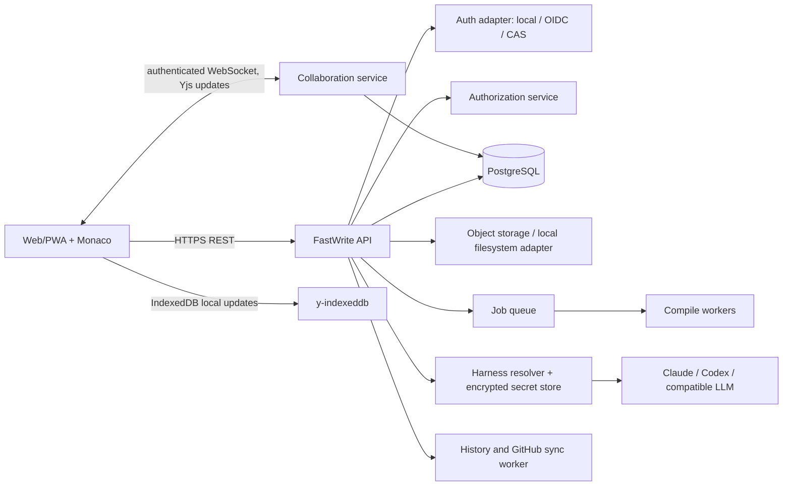
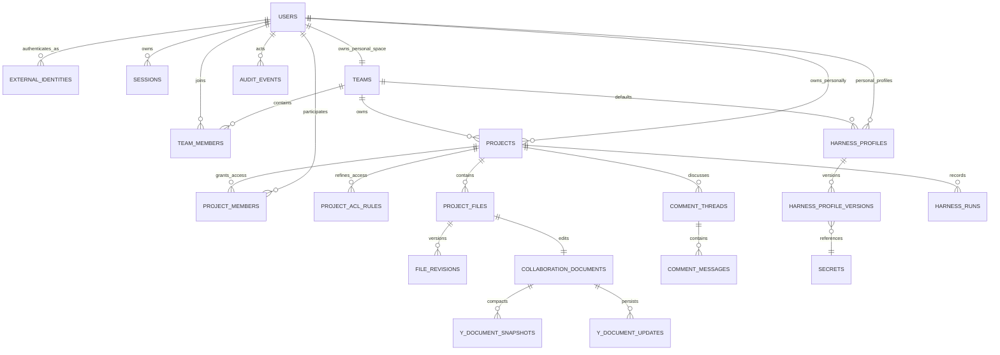

# FastWrite 账号、团队、实时协作与写作能力规划

> 制定日期：2026-09-16
>
> 适用基线：FastWrite 当前 Bun + React + Monaco + JSON Workspace 服务。本文是实施规划，不改变既有 `docs/RDA.md` 中“正文真相、AI 候选须审批、证据优先”的产品契约。

## 1. 决策摘要

FastWrite 应从单机论文工作台演进为可自托管的多租户论文协作平台，保留桌面/单机运行方式。第一阶段采用本地账号；认证层以 OIDC 为标准扩展点，并提供 CAS 适配器。CAS 不应渗入业务服务或权限判断。

实时正文使用 Yjs CRDT，传输和持久化使用可横向扩展的协作服务。Yjs 只负责会话中的文本状态、远端光标和离线合并；PostgreSQL 中的文件修订才是编译、Review、ChangeSet、Git 历史及 GitHub 同步读取的稳定版本。这样既避免多人编辑互相覆盖，也保留当前“AI 修改必须人工接受”的边界。

存储从 JSON 数据库迁移到 PostgreSQL，项目文件和编译产物转入对象存储或本地兼容实现。将当前匿名分享链接改为受控的项目邀请；可保留匿名只读/评论链接为独立的、显式开关的发布功能。Harness 配置按系统、团队、个人三层继承与解析，密钥始终加密存储且不会回传客户端。

不建议直接复用 Overleaf、Scribe、HeyTeX 或 Docs 的业务代码：它们的许可证、技术栈和数据模型均不适合作为 FastWrite 的内嵌依赖。应借鉴其架构并使用 MIT/Apache 兼容的基础库。

## 2. 当前基线与差距

| 当前实现 | 已有价值 | 进入目标架构后的处理 |
| --- | --- | --- |
| `PaperProject` 只有项目属性，没有所有者、团队或成员模型 | 论文、文件、版本、内部 Git 和 AI 工作流已存在 | 给项目增加 `owner_principal_id`、`team_id`、`visibility`，所有访问先经过授权服务 |
| `JsonDatabase` 写入单个 `database.json` | 轻量本地包仍可工作 | 服务器模式迁移 PostgreSQL；单机模式保留 SQLite 实现同一 repository 接口 |
| `WorkspaceService.saveTextFile` 使用 `PaperFile.version` 乐观锁 | 可作为落盘修订闸门 | CRDT flush 生成新的文件 revision；REST 保存只用于非协作写入、结构操作和兼容接口 |
| `SourceEditor`、`app.ts`、`server.ts` 有 Yjs/WS 原型 | 已验证 Monaco 与 Yjs 的基本可行性 | 删除“全量状态 REST + 进程内 Y.Doc + 无鉴权 WS”路径，换成认证、二进制增量、持久化、awareness 的 provider |
| `ProjectShare`/`ShareComment` 是 token 链接和行号评论 | 有外部审阅入口雏形 | 迁为账户成员、邀请和线程评论；链接分享成为受策略约束的次要能力 |
| Harness 配置当前来自环境变量和项目设置，API key 仅在内存 | 已有 Claude/Codex adapter、MCP audit 和 session/run | 抽出配置作用域、密钥库、授权与账本；运行时只接收已解析配置 |
| Monaco 三栏论文工作台 | 已有编译、PDF、Outline、AI diff | 以 IDE 壳层、活动栏、面板、命令面板和协作状态增强，不改为卡片式编辑器 |

现有原型的关键限制是：协作文档和 presence 都在进程内存中；WebSocket URL 不含身份令牌，REST 协作接口不做项目授权；前端轮询并以整个 Yjs 文档覆盖 Monaco 内容；评论以不稳定的行号锚定。这些限制使其只能作为本地 demo，不能渐进加固为生产协作层。

## 3. 范围、非目标与原则

### 范围

1. 本地账号、会话、管理员后台、团队、成员邀请和项目归属。
2. 为统一 CAS 登录预留可部署的认证适配器，同时支持标准 OIDC/SAML 的企业 IdP。
3. 系统、团队、个人三层 Harness 配置，支持 Codex、Claude 和 OpenAI-compatible provider，配置继承可解释、可审计。
4. 项目邀请、角色、文件/目录/功能级权限，协作编辑、presence、评论、离线编辑与重新联网合并。
5. 面向 LaTeX 的现代 IDE 工作台和可访问的键盘操作。
6. 写作 skill、研究工具和学术工作流的受治理扩展体系。

### 本期不做

- 不将 AI 设为与人类拥有相同写权限的协作者。AI 仍只能产生 ChangeSet，且以发起人的权限与 Harness 预算执行。
- 不以浏览器本地缓存替代服务端备份、项目历史或审计。
- 不为每一个社区 skill 直接开通网络、Shell 或数据库权限。导入内容先进入审核、版本化和能力声明流程。
- 不在第一期实现跨项目共享团队记忆、自动分摊 LLM 费用或语音会议。

### 不变的产品原则

- Workspace 源文件是论文正文真相；CRDT 文档是编辑会话状态。
- 高风险写入保持“提议、Diff、审批、落盘、编译、可回滚”。
- 权限检查在服务端，客户端 UI 隐藏入口只是体验优化。
- 证据、引用、审稿和 AI 产物记录作者、发起者、项目修订、skill 版本和 Harness 配置指纹。

## 4. 目标架构



推荐服务器部署为 API、协作服务、worker、PostgreSQL、Redis 和 S3 兼容对象存储六个可独立扩容的进程。首个自托管版本可以使用单个 Bun 进程、PostgreSQL 和 Redis，但接口边界不得绑定到单进程内存。桌面/单机包使用 SQLite、文件系统、内嵌队列和 loopback collaboration provider，实现同一端口。

### 4.1 持久化和事务

采用 PostgreSQL 15+，以 Prisma/Drizzle 或 SQL migration 管理前向迁移；建议直接使用 SQL + repository 接口以保持 Bun 运行时控制力。每次授权范围改变、项目成员变化、Harness 密钥替换和审计记录在一个事务内完成。对象存储用于项目二进制文件、导出物、PDF、SyncTeX 和加密备份；正文文本的当前内容可保留为版本化对象或 `file_revisions` blob，按性能测试决定。

Yjs 以二进制 update append-log 存于 `y_document_updates`，按文档分区；每 1,000 个 update 或 5 MB 后生成 snapshot 并事务性删除已压缩 update。协作服务重启时由最新 snapshot + 后续 update 重建。不得把整个 Y.Doc 反复放进数据库 JSON 字段。

### 4.2 文本、文件与编译的一致性

每个可编辑文本文件对应一个 `collaboration_document`，键为 `project_id + normalized_path`。Yjs 文本字段固定为 `content`，Awareness 仅发送临时 presence，绝不写入数据库或审计作为事实。

协作服务在空闲 1 秒、累计 5 秒或收到“编译/AI/切换文件”屏障时执行 flush：在项目级短锁内读取 Yjs 文本，创建 `file_revision`，递增兼容的 `PaperFile.version` 与 `PaperProject.version`，随后触发现有 Git checkpoint 策略。编译、Agent Plan、Review、ChangeSet Accept 与 GitHub Sync 都先请求 `flushProject(projectId)`，再读取该项目修订。AI 的基础版本因此可精确声明为某次已持久化修订。

结构操作（重命名、删除、上传、主文档切换）由 API 获得项目写锁，通知并关闭关联 Yjs room，完成元数据和文件移动后创建新的 document ID；客户端收到 `project-structure-changed` 后重新订阅。禁止用路径字符串偷偷复用旧 Yjs 状态。

## 5. 身份认证、CAS 与会话

### 5.1 认证端口

定义业务无关的 `IdentityProvider`：

```ts
interface IdentityProvider {
  beginLogin(input: LoginStart): Promise<LoginRedirect | LocalLoginResult>;
  finishLogin(input: LoginCallback): Promise<ExternalIdentity>;
  logout(session: Session): Promise<void>;
}
```

`ExternalIdentity` 只规范 `issuer`、稳定 `subject`、email、displayName、username、groups 和已验证声明。`User` 用 `(issuer, subject)` 唯一关联，email 不能作为唯一主键。默认适配器是本地 email/password（Argon2id、邮箱验证、MFA 预留）；OIDC 使用 Authorization Code + PKCE、JWKS 验签和 nonce/state；CAS adapter 封装 CAS 3.0 service-ticket 验证，将属性映射到相同的 `ExternalIdentity`。部署配置选择一个 primary provider，可允许本地 break-glass 管理员。

CAS 接入前只需配置 CAS server URL、service URL allowlist、属性映射、登出回调和受信任证书。若学校 CAS 同时发布 OIDC，优先 OIDC，CAS adapter 仍保留给传统环境。禁止让前端直接持有 CAS ticket 或 IdP access token。

### 5.2 会话与管理员

使用短期 access session（15 分钟）和轮换 refresh session（30 天、HttpOnly、Secure、SameSite=Lax cookie）；每次刷新检测重放并撤销同一 token family。客户端先通过已认证 API 取得短期 room token，再以 room token 建立 WebSocket；room token 绑定 session、权限版本、project、规范化路径和读写 scope，不能替代通用 API bearer。服务器在 upgrade 与定期重鉴权时验证 room token、session 与当前权限。注销、禁用用户、移出团队、撤销邀请和角色降级必须使相关 session 与 WS 连接失效。

平台角色为 `platform_admin`、`support_auditor`、`user`。管理员后台分为用户/身份源、团队、项目索引、系统 Harness、skill 审核、审计与运行健康；`support_auditor` 默认仅看元数据和已获授权的诊断，不能查看论文内容或 LLM 密钥。所有管理员读取正文与代表用户操作均要理由、双人审批开关和不可篡改审计。

## 6. 团队、项目和权限模型

### 6.1 资源与角色

团队是账单、成员、默认 Harness、共享 skills 与项目容器；个人空间是每位用户自动拥有的私有 team-like namespace。新项目必须选择个人空间或某个有 `project:create` 的团队。个人项目可邀请协作者，不会因邀请自动变成团队资产；可由 owner 显式转移到团队，保留审计链。

项目预设角色如下。细粒度授权以 capability 为准，角色只是可维护的权限包。

| 能力 | Owner | Maintainer | Editor | Commenter | Viewer |
| --- | --- | --- | --- | --- | --- |
| 查看文件、PDF、评论 | 是 | 是 | 是 | 是 | 是 |
| 实时编辑正文、上传、编译 | 是 | 是 | 是 | 否 | 否 |
| 创建/接受 AI ChangeSet | 是 | 是 | 可提议；接受需授权 | 否 | 否 |
| 发起 Review、管理评论 | 是 | 是 | 是 | 创建/回复 | 否 |
| 访问/执行项目 Harness | 是 | 是 | 按团队策略 | 否 | 否 |
| 邀请成员、设置文件规则 | 是 | 是 | 否 | 否 | 否 |
| 删除、转移、GitHub 凭据、成员角色 | 是 | 可受限 | 否 | 否 | 否 |

团队还有 `team_owner`、`team_admin`、`team_member`、`team_guest`。团队角色授予项目默认权限，项目 ACL 可以增加或收紧权限，但不能越过团队的数据隔离和平台策略。`deny` 优先于 `allow`；所有判定输出可供 UI 显示的 reason code。

### 6.2 细粒度 ACL

资源层级为 `team -> project -> path-prefix -> feature`。规则的 subject 可为 user、team role 或来自 IdP 的 group；action 是 `read`、`comment`、`edit`、`manage`、`run_ai`、`manage_harness`、`export`、`sync_github`。路径规则采用规范化前缀，禁止 `..` 和通配跨界；文件级拒绝例如可保护 `secrets.tex`。主文档、构建配置和 GitHub credential 默认要求 maintainer 以上。

首次发布只实现项目角色和团队默认权限；路径 ACL 在第二期上线，因为它会影响编辑器订阅、搜索、编译上下文、Agent 上下文和 Git 操作。任何项目读取 API、asset URL、协作 room、后台 job 都调用同一 `authorize(principal, action, resource)`，而不是散落的 route 判断。

### 6.3 邀请流程

邀请表保存 project/team、目标 email 或 user、提议角色、邀请人、到期日、一次性哈希 token 和状态。接受时若 email 匹配已验证账户则添加成员；否则完成注册/SSO 登录后绑定。邀请可撤销、可重发、限速；角色提升和 owner 转移需要二次确认。所有成员变动生成审计事件并向在线客户端广播权限变更。

## 7. Harness 配置、密钥与治理

### 7.1 三层继承与解析

配置对象名为 `HarnessProfile`，包含 provider、model、base URL、wire API、timeout、allowed tools、MCP server allowlist、最大并发、预算/日限额、数据驻留标签和密钥引用。配置只保存密钥 ID，密钥 material 存在独立 secret store。

解析顺序为：系统默认（必有） -> 团队默认（可选） -> 用户个人 profile（可选） -> 项目显式绑定（只选择已获允许的 profile，不复制密钥）。最终 profile 是不可变的 `ResolvedHarnessProfile`，在每次 run 写入 config fingerprint 和来源链。

个人 profile 只有团队允许 `personal_harness` 时可覆盖 model/provider；团队可强制“仅团队 profile”或“系统 profile”。项目成员不能借 owner 的个人密钥运行任务。用户在团队项目中执行 AI 时，默认使用团队 profile；个人空间默认使用个人 profile，缺失时回退系统。管理员设置系统 profile，团队 owner/admin 管理团队 profile，用户仅管理自己的 profile。

### 7.2 密钥和审计

服务端用 envelope encryption：每条 secret 由 data encryption key 加密，DEK 再由环境 KMS/Vault master key 包裹；开发/单机模式允许由 `FASTWRITE_SECRETS_MASTER_KEY` 派生的本地 key。密钥只允许创建、替换、删除、连接测试和显示尾部指纹，绝不从 API 返回。替换密钥时新旧 profile 版本并存直至在途 run 结束。

每个 Harness Run 记录发起用户、代表团队、解析 profile 版本、模型、成本/令牌计量、工具调用摘要、ChangeSet ID 与项目修订。论文正文、prompt 与 provider 响应沿用当前最小化和安全日志约束；管理员审计默认不可读正文。为团队引入使用上限、并发限制、允许模型列表和异常告警。

## 8. 实时协作、评论与离线编辑

### 8.1 协作协议

前端使用 `yjs`、`y-websocket` 协议兼容 provider（或 Hocuspocus-compatible server）和 `y-indexeddb`。每个连接先经 API 申请短期 room token，token 包含 `user_id`、`project_id`、`path/document_id`、`edit/read` scope、权限版本和过期时间。协作服务在连接、同步、Awareness 更新和持久化前都验证 scope；Viewer/Commenter 只能接收同步，不能发送 document update。

二进制 Yjs update 通过 WebSocket 增量传输；Redis pub/sub 负责多协作节点 fan-out，PostgreSQL persistence 保证重启恢复。Awareness 载荷只包括用户 ID、显示名、颜色、活跃文件、相对选区和最后活动时间，最大 5 秒心跳，离线 30 秒过期。服务端为每个用户分配颜色，不接受客户端伪造姓名/权限。

Monaco 需要一个 `Y.Text <-> ITextModel` binding，应用 remote transaction 时设置 origin，防止回声与 undo 污染；本地 UndoManager 按作者 origin 管理，Ctrl/Cmd-Z 只撤回本人动作。将现有 `setValue` 全量覆盖与 polling 删除。

### 8.2 评论与建议

评论采用 `comment_threads` + `comment_messages`。锚点由 `document_id`、Yjs `RelativePosition` 起止位置、创建时 quote、前后文 hash 与 file revision 组成。Yjs 重排后自动重定位；锚点丢失时标为 orphaned，用户可重新附着。线程支持回复、resolve/reopen、提及、附件引用和权限校验。

“建议修改”不直接写入 Yjs：它创建一个带 source revision、作者和范围的 ChangeSet/评论建议，项目 Editor/Maintainer 接受后才落盘。这与现有 AI ChangeSet 的审批体验统一，且能保留作者归属。评论与建议可跨文件显示在右侧协作面板和活动栏 badge 中。

### 8.3 离线策略

PWA service worker 缓存 app shell、Monaco worker、LaTex WASM、最近打开的文件和只读 PDF；Yjs 更新由 IndexedDB 保存。网络断开时编辑器显示 `Offline - local changes queued`，允许正文编辑、个人 undo 和本地可用的 WASM 编译；禁用邀请、云编译、团队 Harness、GitHub sync 和需服务端证据的数据写入。

重连后 provider 先同步 CRDT updates，再 flush 成文件 revision。Yjs 可自动处理文本并发；路径结构、二进制文件、删除后编辑、项目权限已变更、GitHub 外部修改和 AI ChangeSet 基础版本冲突进入显式三方解决 UI。离线用户权限在 token 到期后只能继续本地编辑，不能向服务端推送，重新认证且重新授权后才能同步。

## 9. IDE 体验与 UI 设计

### 9.1 信息架构

保留论文编辑优先的桌面布局：左侧 48px 活动栏切换 Explorer、Search、Outline、Git/History、Research、Review；左侧边栏显示当前视图；中央保留标签页、面包屑、Monaco 编辑器与可选 split editor；右侧面板是 PDF、Problems、Comments、AI Review；底部状态栏显示同步、协作者、文件修订、编译状态、当前 Harness 和行列号。

顶部只保留项目/团队切换、全局搜索、Compile、Share/Invite、协作者头像和账号菜单。所有功能注册进 Command Registry，`Cmd/Ctrl+K` 可查找动作，`Cmd/Ctrl+P` 文件跳转，`Cmd/Ctrl+Shift+P` 命令面板。快捷键需可发现、可重绑，且遵从 Monaco 默认行为。

### 9.2 协作和 AI 交互

远端光标以姓名色条、选区和 hover 身份呈现；超过五人时聚合头像并在协作者面板列出所在文件。右侧评论侧栏按“当前文件、未解决、提及我”筛选，编辑器 gutter 显示可点击锚点。权限不足时显示具体理由和请求访问入口，而不是静默失败。

AI 工作区仍采用 Revise/Agent/Review 三个任务模式，增加可折叠 Activity timeline，展示谁以哪个 profile 发起、候选依据的修订、审批者和编译结果。团队默认 Harness 在状态栏显示来源，个人 override 显示为受策略允许的标记；不显示 API key 或原始 prompt。

### 9.3 视觉与可访问性标准

采用现有 light/dark token 并扩展 `--surface`、`--border`、`--focus`、语义状态色和协作者颜色，不引入营销式大卡片。按钮使用已有 lucide icon；工具按钮有 tooltip 与 aria-label；面板尺寸可拖拽、移动端切换为单栏且不丢失评论/审批操作。通过键盘完整操作、WCAG 2.2 AA 对比度、焦点可见、屏幕阅读器 live region（同步/编译/权限变化）和 `axe-core` CI 检查验收。

## 10. 写作 skills、工具与生态调研

### 10.1 调研方法与结论

本次调研检查了仓库内参考实现以及截至 2026-09-16 的公开 GitHub 项目。星标和活跃度仅用于发现候选，不能代表学术准确性、安全性或许可证兼容性。FastWrite 的现有 Skill 已覆盖论文结构、领域/venue、证据边界、draft/revise/review/completion；外部生态最值得吸收的是任务分类、可验证的引文工作流、期刊规则数据和研究工具接入，而不是不加审查地导入长 prompt。

| 候选 | 可借鉴内容 | 采用方式 | 不直接采用的原因 |
| --- | --- | --- | --- |
| `aipoch/medical-research-skills`（MIT，1,878 stars） | 大量医学研究任务、protocol、证据与写作分类 | 选择性转写为 FastWrite 的 skill manifest；仅启用有明确输入/输出/引用边界的任务 | 医学范围与安全要求特殊；不能把工具权限或提示词整包导入 |
| `LeonChaoX/qinyan-academic-skills`（MIT，897 stars） | 多语言、端到端学术任务目录 | 作为 taxonomy 对照，补齐 literature、grant、rebuttal、submission skill | 182 个 skill 的质量和维护状态不均，需逐条评估 |
| `YSLAB-ai/manuscript-writing`（MIT） | revision/review 中的 citation、evidence、clarity 检查 | 映射到现有 Writing Guard 和 Review issue schema | 体量小，需验证示例和评测 |
| `ShZhao27208/Aut_Sci_Write` | 文献检索、PDF extraction、Zotero、图表/演示工作流 | 作为可选 MCP 工具候选，先定义数据来源和许可 | 外部检索与下载必须经用户授权和来源审计 |
| `Scribe` 参考项目（AGPL-3.0） | Yjs、Postgres persistence、离线 SQLite、AI adapter、编译队列的整体分层 | 借鉴部署边界和阶段拆分 | 不能混入业务代码，避免 AGPL 传染与大规模 Rust/Tauri 改写 |
| Overleaf CE（AGPL-3.0） | LaTeX 项目、多人协作、邀请和编译隔离的成熟领域模型 | 用作 UX/安全基线，特别是编译 sandbox 风险 | 不嵌入 CE 代码；其 Community Edition 明确不适合不可信用户隔离 |
| Mist（MIT）与 La Suite Docs（MIT） | Yjs、presence、评论、offline、Hocuspocus/OIDC 的实现经验 | 参考评论锚点、provider 与 OIDC 运维模式 | 富文本模型不能直接替代 LaTeX 源码模型 |

### 10.2 FastWrite skill 治理模型

把当前目录式 `SKILL.md` 升级为带 manifest 的可发布单元：

```text
skills/<id>/<version>/
  skill.md                 # 人和模型可读的指令
  manifest.json            # schema, inputs, outputs, capabilities, license, owner
  checks/                  # deterministic validators
  fixtures/                # positive/negative examples and expected findings
  references.json          # source URLs, licenses, venue/version dates
```

manifest 必须声明 `scope`（system/team/project）、支持工作流、所需证据、可调用 MCP capability、最大上下文、风险等级、许可证和版本。系统 skill 由管理员审核发布；团队私有 skill 由 team admin 发布；项目 skill 仅项目可见。skill 在每个 AI run 中按 immutable version pin，后续升级不改变已运行结果。

优先建设六类 skill：论文/期刊格式与投稿合规、文献检索与引文验证、研究设计与统计报告、证据驱动 draft/revise、匿名审稿与 rebuttal、中文/英文双语学术表达。每类先有一个高质量、可测试的最小 skill，而不是发布大量重叠 prompt。现有 `writing-guard`、claim ledger、evidence boundary 应作为任何外部 skill 的强制 validator，不能被 skill 指令绕过。

### 10.3 工具接入

MCP server 按 capability allowlist 注册：`literature.search`、`bibliography.read/write`、`citation.verify`、`pdf.extract`、`latex.compile`、`workspace.read`。默认只给 read capability；网络检索、下载、Zotero 写入、GitHub push、命令执行需要团队策略和每次或持久授权。工具输出写成带来源、时间、输入摘要和许可证的 Evidence，不能直接变为论文事实。

建议第一批评估：Crossref/OpenAlex/Semantic Scholar 的元数据检索、Zotero 本地/团队 library adapter、GROBID/科学 PDF 文本提取、Pandoc 导入导出，以及 LaTeX linter（ChkTeX、texlab/LSP）。先实现抽象接口和 mock/fixture 测试，再选择具体部署依赖。

## 11. 数据模型与 API 轮廓

### 11.1 核心表

| 域 | 表 | 关键字段 |
| --- | --- | --- |
| 身份 | `users`, `external_identities`, `sessions`, `mfa_factors` | user status、issuer/subject、session family |
| 组织 | `teams`, `team_members`, `team_group_bindings` | slug、个人空间标记、role、IdP group |
| 项目 | `projects`, `project_members`, `project_acl_rules`, `project_files`, `file_revisions` | owner/team、role、path、content hash、revision |
| 邀请 | `invitations`, `share_links` | resource、email/token hash、role、expiry、revocation |
| 协作 | `collaboration_documents`, `y_document_snapshots`, `y_document_updates` | document ID、path、state vector、sequence、bytes |
| 评论 | `comment_threads`, `comment_messages`, `comment_mentions` | relative anchors、quote、status、author |
| Harness | `harness_profiles`, `harness_profile_versions`, `secrets`, `harness_policy`, `harness_runs` | scope、source chain、secret ref、policy、usage |
| 治理 | `audit_events`, `skill_packages`, `skill_releases`, `skill_assignments` | actor、target、request ID、license、immutable version |

原有 agent runs、ChangeSets、reviews、memory、research、claims、compile records、GitHub sync runs 全部增加 `actor_user_id`、`team_id`（适用时）、`project_revision`、`skill_release_id` 和 `resolved_harness_profile_version_id`。数据库 Row-Level Security 可作为第二道保护，但应用授权服务仍是唯一业务规则入口；worker 使用受限 service role 并再次检查作业创建时的权限快照。

### 11.2 主要 API

- `POST /api/auth/login`, `/callback/:provider`, `/refresh`, `/logout`, `/me`
- `GET/POST /api/teams`, `PATCH /api/teams/:id`, `POST /api/teams/:id/invitations`
- `GET/POST /api/projects`, `POST /api/projects/:id/invitations`, `PATCH /api/projects/:id/members/:userId`
- `GET/PUT /api/projects/:id/acl`, `POST /api/projects/:id/access-requests`
- `POST /api/collaboration/tokens`，协作端点为 `/collaboration/:documentId`（WebSocket）
- `GET/POST /api/projects/:id/comments`, `PATCH /api/comments/:id`, `POST /api/comments/:id/reanchor`
- `GET/POST /api/harness/profiles`, `POST /api/harness/profiles/:id/test`, `GET /api/harness/effective`
- `GET/POST /api/admin/identity-providers`, `/admin/skills`, `/admin/audit-events`

所有列表按当前 principal 过滤，所有 mutation 带 request ID、CSRF 防护（cookie 会话时）、rate limit 和结构化错误码。旧的 `/api/shared/:token` 迁移期间只允许显式启用，且映射到 `share_links` 与受限 viewer/commenter principal。

## 12. 分期实施计划

每期都必须可部署、可回滚并包含数据迁移演练。估算以一个熟悉 TypeScript/Bun 的工程师为单位，实际排期取决于安全审计、部署环境和 CAS 对接方。

| 阶段 | 目标与交付物 | 依赖 | 估算 |
| --- | --- | --- | --- |
| 0：架构准备 | ADR、repository 接口、feature flags、威胁建模、基准与备份/恢复演练 | 无 | 1-2 周 |
| 1：身份与数据底座 | Postgres schema、数据迁移、local/OIDC auth、session、个人空间、授权 middleware、管理员最小后台 | 0 | 3-4 周 |
| 2：团队与项目治理 | 团队、邀请、项目成员/角色、审计、项目归属迁移、受控分享链接 | 1 | 2-3 周 |
| 3：Harness 多作用域 | profile/secret store、继承解析、团队策略、run 账本、现有项目设置迁移 | 1-2 | 2-3 周 |
| 4：协作核心 | 认证 Yjs provider、Postgres persistence、Monaco binding、presence、flush barrier、多人 load test | 1-2 | 4-5 周 |
| 5：评论与离线 | relative anchors、线程与建议、PWA/IndexedDB、重连与结构冲突 UI | 4 | 3-4 周 |
| 6：IDE 体验 | 活动栏、面板、命令注册、协作面板、权限/同步状态、a11y 和响应式优化 | 2、4、5 | 3-4 周 |
| 7：Skills 与工具 | manifest/release、审核后台、MCP policy、首批高质量 skills、评测集 | 1、3 | 3-5 周 |
| 8：生产加固 | queue/worker、编译 sandbox、指标、备份、灾备、渗透/权限审计、文档 | 1-7 | 3-4 周 |

### 阶段 0 的明确任务

1. 写 ADR：认证端口、Postgres/object storage、Yjs provider、密钥管理、授权语义、单机模式。
2. 为现有 API 建立 contract tests，冻结项目、文件、ChangeSet、Review、Harness 和 GitHub Sync 的行为。
3. 建立 `StorageRepository`、`AuthRepository`、`AuthorizationService`、`SecretStore`、`CollaborationPersistence` 接口，不在此阶段改变产品功能。
4. 建立 feature flags：`server_auth`、`teams`、`scoped_harness`、`realtime_v2`、`comments_v2`、`pwa_offline`；生产按团队或项目灰度。
5. 记录 JSON 数据清点、导出器、校验器和幂等 migration cursor。

### 阶段 1-3 的迁移顺序

1. 导入 JSON 为 bootstrap system user 和一个 legacy personal workspace；每个旧项目归属该 workspace，保留原 ID 映射表。
2. 上线登录后，用户认领 legacy workspace；未认领项目只由平台管理员按受控流程处理。
3. 将旧 Project Settings 转为个人或系统 Harness profile。历史 run 保存原始红脱敏 fingerprint，不将内存 API key 写回数据库。
4. 新旧读取短暂双写、Postgres 比对、只读切换、备份验证后移除 JSON 写路径。不得长期维护两个真相来源。

### 阶段 4-6 的切换顺序

1. 先在选定项目启用 read-only Yjs 同步，比较 Yjs flush 文本与文件 revision hash。
2. 启用双人可编辑、presence 和 flush barrier，保留旧 save API 作为兼容层。
3. 在实时协作稳定后迁移 comments；旧匿名分享评论导入为 legacy thread，提示重新锚定。
4. 离线功能仅在可靠的 reconnect、权限失效和冲突 UX 通过 E2E 后公开。

## 13. 验收、测试和运行指标

### 必须通过的场景

| 类别 | 验收例子 |
| --- | --- |
| 身份 | OIDC/CAS 回调不能绑定错误账户；禁用用户立即失效 session/WS；email 变化不产生新用户 |
| 授权 | Viewer 无法读取 asset、WS update、AI context 或导出；移出团队后不能继续同步离线更新；path deny 对搜索、编译、Agent 一致生效 |
| Harness | 同一用户在个人/团队项目分别解析正确 profile；团队禁用 personal override 后请求被拒绝；API key 不出现在响应、日志、审计或浏览器存储 |
| 协作 | 两个用户离线编辑同段文字并重连后合并；100+ 并发 room 不丢 update；重启后 snapshot/update 恢复；远端编辑不破坏本地 undo |
| 工作流 | 编译、Review、Agent 与 GitHub Sync 都先 flush，记录精确 revision；AI 接受后不覆盖随后协作者的文本 |
| 评论 | 编辑、移动文本后锚点正确跟随；删除锚点时显示 orphaned；Commenter 无法编辑正文 |
| 离线 | 断网可编辑和重开恢复；token 过期后不上传；重新授权后按最新 ACL 处理 queued updates |
| UI | 键盘可完成项目邀请、评论、Diff 审批和状态查看；axe 无严重违规；窄屏无文字重叠 |

测试层次包括：domain/repository 单测，API/鉴权集成测，双浏览器 Playwright 协作测，断网/重连/重启混沌测，Yjs property/fuzz 测，migration fixture 测，权限矩阵参数化测试，技能 fixtures 与 deterministic guard 评测。对 CAS 使用 mock server 和至少一个真实学校测试环境的 staged validation。

上线指标：协作连接成功率、update p95 延迟、flush p95、CRDT snapshot 恢复时间、离线队列冲突率、授权拒绝原因分布、Harness profile 解析失败率、AI run 成本、编译队列延迟、评论 orphan 率。日志使用 request/session/project 的伪匿名 ID；指标不得含论文正文、prompt 或密钥。

## 14. 安全、可靠性与运维

- LaTeX 编译必须进无网络、非 root、CPU/内存/时长/磁盘受限容器；Overleaf CE README 同样警示未 sandbox 的编译不适合不可信用户。多租户版本把此项列为上线阻断。
- 对象存储所有访问使用项目授权签发的短期 URL；数据库备份、Yjs snapshot、Git 历史和 secrets 分别定义 retention 与恢复演练。
- WebSocket 设置消息大小、速率、每项目并发、Awareness 频率和压缩阈值，防止单一大文档/恶意 update 耗尽内存。
- 使用 CSP、CSRF、输入路径规范化、HTML/Markdown 评论 sanitization、邀请 rate limit、审计防篡改存储和依赖/SBOM 扫描。
- 按团队导出与删除数据；删除项目采用软删除、隔离期、异步清除对象/Yjs/队列，且保留最小审计元数据。

## 15. 已知风险与缓解

| 风险 | 影响 | 缓解 |
| --- | --- | --- |
| 同时把 JSON、实时协作、团队、UI 全量重写 | 核心编辑回归 | feature flags、repository 适配层、阶段化双读校验、每期独立发布 |
| Yjs 与 AI/Git 的版本边界不清 | AI 覆盖协作者文本或结果无法追溯 | flush barrier、project revision、ChangeSet 基础内容与三方冲突流程 |
| CAS 属性质量不稳定 | 重复账户或错误授权 | issuer+subject 主键、属性映射预览、账号合并需管理员审计 |
| 团队密钥被误用或泄露 | 成本和数据风险 | envelope encryption、来源链、团队策略、限额、日志脱敏、密钥轮换 |
| 路径级 ACL 影响编译完整性 | 论文无法构建或泄露上下文 | 首版仅项目级角色；路径 ACL 上线前设计“编译服务身份”和受限文件错误 UX |
| 外部 skills 幻觉、许可或工具越权 | 学术/法律风险 | manifest、版本、许可证审查、evidence boundary、capability allowlist、fixture 评测 |

## 16. 参考材料

### 本仓库和已检视参考项目

- `docs/DESIGN.md`、`docs/RDA.md`、`docs/DEV.md`：FastWrite 的既有正文、审批、版本和协作边界。
- `apps/server/src/storage/database.ts`、`apps/server/src/workspace/workspace-service.ts`、`apps/server/src/app.ts`、`apps/server/src/server.ts`、`apps/web/src/components/workspace/SourceEditor.tsx`：当前 JSON、文件版本和协作原型。
- `references/overleaf/README.md`：实时协作 LaTeX 产品与非 sandbox compile 的安全限制。
- `references/Scribe/README.md`、`references/Scribe/PLAN.md`：Yjs、Postgres、Redis、离线 SQLite 和分期建设的参考。
- `references/mist/README.md`、`references/mist/docs/technical-architecture.md`：Yjs/TipTap/CRDT 的精简协作实现。
- `references/docs/README.md`、`references/docs/documentation/collaboration.md`、`references/docs/documentation/architecture.md`：Hocuspocus、Yjs、OIDC、评论与离线协作。
- `references/HeyTeX/README.md`：LaTeX/Typst、账户和 PWA/持久化建议。
- `references/collab-md/README.md`：极简 Git-backed 人机协作的边界案例。

### 外部开源生态（访问日期：2026-09-16）

- [Yjs](https://github.com/yjs/yjs)：CRDT 基础库，22,797 stars；采用其增量合并模型。
- [medical-research-skills](https://github.com/aipoch/medical-research-skills)：MIT，1,878 stars；作为医学研究 skill taxonomy 候选。
- [qinyan-academic-skills](https://github.com/LeonChaoX/qinyan-academic-skills)：MIT，897 stars；作为多语言学术 skill 分类候选。
- [manuscript-writing](https://github.com/YSLAB-ai/manuscript-writing)：MIT；作为 evidence/citation/clarity revision 参考。
- [Aut_Sci_Write](https://github.com/ShZhao27208/Aut_Sci_Write)：文献、PDF、Zotero 与写作工具工作流参考。

## 17. 开工前的三个产品确认点

本文按以下默认决策排期：部署目标是可自托管的服务器模式且保留单机包；首发账号使用本地登录并可配置 OIDC/CAS；团队项目由团队 Harness 策略控制个人 override。若部署方已经确定 CAS 属性、现有 IdP、密钥托管服务或组织层级，阶段 0 应将这些值写入 ADR 和 migration fixture，再开始数据层实现。

## 18. 完整需求追踪与最终交付边界

本节是本规划的范围基线。每项原始目标均须在最后的生产验收中达成，阶段性发布只是降低交付风险，不代表目标缩减。

| 原始目标 | 最终交付定义 | 关键依赖 | 验收证据 |
| --- | --- | --- | --- |
| 账号、CAS、管理员、团队、统一 Harness | 用户可本地注册或登录统一身份源；管理员可管理身份源、用户、团队、策略、skills 和审计；每次 AI run 都有唯一、可解释的系统/团队/个人 Harness 来源 | 身份、授权、secret store、审计 | 身份源集成测、权限矩阵、Harness resolution report、审计导出 |
| 团队/个人论文项目与协作者 | 项目创建时选择个人或团队归属；可邀请、撤销、转移项目并管理项目角色及 ACL | 团队、邀请、项目成员、通知 | 两账户 E2E、项目转移审计、失效邀请与撤权测试 |
| 实时协作、光标、评论、细粒度权限、离线 | 多人低延迟编辑同一 LaTeX 文件；可见可信光标；评论随文本移动；网络断开仍能写作，重连后合并；未经授权者无法读写任何路径或协作 room | Yjs、WebSocket、PWA、ACL、版本服务 | 多浏览器/断网/重启/权限变更 E2E、负载与混沌测试 |
| 现代化 IDE 编辑体验 | 桌面与窄屏均有文件树、标签、搜索、Outline、Problems、PDF、Git/History、评论、协作者、AI 与命令面板；完整键盘和无障碍支持 | UI shell、命令注册、协作/评论 API | Playwright visual/keyboard、axe、任务完成时间评估 |
| 大规模开源 skill 和工具调研、优化设计 | 有可复现的候选清单、许可证记录、评估基准、skill manifest、发布/回滚/审计机制，以及第一批经测试的技能和工具 adapter | Skill registry、MCP policy、evidence model、eval harness | 每个已发布 skill 的 fixture、license review、运行评测报告 |

最终用户可完成如下完整路径：学校员工从 CAS 登录，进入所属团队，创建或加入论文项目，使用团队允许的 Harness 在审批区处理 AI 候选；两位作者一方离线编辑、另一方在线编辑，网络恢复后文本合并且评论和光标正确；Maintainer 只接受必要 hunk、编译、审稿并同步 GitHub；团队管理员从后台看到可审计的成员、预算、skill 版本和异常，而看不到任何用户密钥或未经批准的论文正文。

## 19. 领域模型与关系约束



必须落实的数据库约束如下：

1. `users.email_normalized` 可变且可重复；`external_identities(issuer, subject)` 全局唯一且不可变。
2. `teams.personal_user_id` 非空时唯一，一个用户恰有一个 personal workspace，个人空间不接受普通成员。
3. 项目恰有一个归属：`team_id` 或 `personal_owner_user_id`，两者不能同时为空或同时非空。项目 owner 必须是项目成员且至少保留一个 owner。
4. `project_members` 与 `team_members` 均有唯一 `(resource_id, user_id)`，角色变更保留有效期和审计，不覆盖历史事件。
5. `project_files.normalized_path` 在项目内唯一；`file_revisions` 只能追加；每个文件的 current revision 由事务更新，content hash 用 SHA-256。
6. `collaboration_documents` 绑定稳定 document UUID，而非可变 path。重命名更新 path mapping、创建新 room token，旧 UUID 进入 archived 状态。
7. `harness_profile_versions`、`skill_releases` 和 `file_revisions` 不可变。删除是软删除/撤销，绝不篡改已审计 run 的引用。
8. 所有带 `team_id` 的数据必须能从 `project_id` 或资源本身推导一致团队；以外键、check constraint 和 service-layer assertion 三层保证。

### 19.1 权限判定算法

每个请求先解析 `Principal`（用户、session、IdP group、平台角色、authz version），再解析资源树。判定次序固定：平台封禁 -> 项目/团队存续 -> 显式 deny -> 资源 ACL allow -> 项目成员 capability -> 团队默认 capability -> 个人空间 owner -> 默认拒绝。返回 `{ allowed, reasonCode, policyVersion }`；`reasonCode` 用于 UI、审计和测试，不泄露资源是否存在给无权者。

后台 job 不能绕过此算法。job 创建时保存 actor、project revision、authorization decision 与 policy version；worker 开始和写回前各复核一次。若用户被撤权，任务取消或转为只读结果，不能把 ChangeSet 写入项目。

### 19.2 权限包与 feature 权限

除文件动作外，必须单独授权以下 feature：`compile:run`、`review:run`、`agent:propose`、`changeset:approve`、`memory:manage`、`research:run`、`skill:assign`、`harness:use`、`harness:manage`、`github:configure`、`github:sync`、`project:invite`、`project:transfer`、`project:delete`、`audit:view`。这样 Editor 可以提出 AI 变更但不能接受团队政策禁止的自动化修改，Commenter 可以参与审稿讨论但无法让外部 LLM 读取论文。

## 20. 端到端业务流程

### 20.1 注册、SSO 和账号关联

1. 用户选择本地登录、OIDC 或 CAS。认证服务创建带 PKCE verifier、nonce、return path 的一次性登录 transaction。
2. 回调验证 issuer、audience、signature、nonce、state、时钟偏差和 service URL。CAS 还必须验证 ticket 一次性使用与 service 精确匹配。
3. 以 `(issuer, subject)` 查找 identity；不存在时根据受验证邮箱仅提出“关联已有账号”的确认，不自动合并。确认后才添加 identity。
4. 首次登录创建用户、personal workspace、默认项目配额和 welcome audit event；若 IdP group 映射团队，按受控同步加入。
5. 创建 session family，签发 cookie，并把 `authz_version` 放进 token claims。浏览器恢复 path 时先获取 `/me` 与权限快照。

失败页不得暴露 IdP 响应、邮箱是否存在或内部用户 ID。管理端可查询脱敏诊断关联 request ID。

### 20.2 创建、邀请、转移和归档项目

创建向导包含名称、个人/团队空间、模板/导入来源、main document、写作 profile、初始成员和可选 Harness binding。创建人自动成为 Owner；团队默认成员按团队策略获得访问但不一定能编辑。导入 GitHub、上传和本地路径沿用现有安全过滤，并将文件写入新 persistence adapter。

邀请人选择邮件/已有账号、角色、可选到期时间和说明。系统发送无正文项目内容的通知；接受人必须先认证，服务端重新评估邀请是否仍有效。移除成员会撤销 room token、结束其可写 WebSocket、取消其运行中的写任务并在审计记录原因。Owner 转移要求接收方确认；个人到团队转移、团队到个人转移分别需两侧 owner/admin 权限并在不可逆操作前创建 checkpoint。

归档项目改为只读，保留 Viewer、评论和历史；恢复由 Owner/Maintainer 操作。删除先进入 30 天隔离区，期间仅 Owner 可恢复；之后清除正文、对象和 Yjs 数据，保留最小合法审计记录。

### 20.3 AI 运行和审批流程

1. 用户发起 Completion、Revise、Agent、Review 或 Research。API 先检查 feature 权限、团队策略、额度和项目同步状态。
2. API 调用 `flushProject` 并取得 immutable `project_revision`；按照工作流最小上下文规则组装输入。
3. `HarnessResolver` 解析 profile 来源链、密钥版本、模型和 MCP allowlist；创建带 actor/team/revision/skill release 的 run。
4. provider/MCP 仅以 service-side short-lived capability 访问已授权文件和工具；任何文件写操作仍转换为候选 ChangeSet。
5. 用户或具备 `changeset:approve` 的成员逐 hunk 审核。接受时服务端再次 flush、比较 base revision、进行三方合并或显示冲突；写入成功后生成 file revision、Git checkpoint、compile job 和审计。
6. 结果页显示“由谁、以何种团队/个人配置、基于哪个修订、使用哪个 skill 版本”而非暴露 prompt 与 secret。

### 20.4 协作编辑流程

1. 用户打开文件，API 校验 `read` 后返回文件 revision、document ID、短期 room token 和 read/write scope。
2. 客户端先从 IndexedDB 载入本地 Yjs updates，再连接协作服务。服务端验证 token、加载 snapshot/updates，双方用 state vector 交换缺失 update。
3. 客户端建立 Monaco binding 后发送 local update 与 Awareness；远端 update 只改变模型，不触发 REST 全量保存或另一个用户的 undo stack。
4. idle/periodic/barrier 触发 flush，服务端生成 revision 并广播 `flushed(revision)`。每个客户端更新保存状态但继续保留未同步本地 update。
5. 用户被撤权或 token 到期时 room 进入 `read-only`/`reauth-required`；local cache 保留，重新认证后才可 push。

### 20.5 GitHub 和外部文件变化

GitHub Sync 与协作不是两个正文真相。同步开始时锁住项目结构、执行 CRDT flush、以已持久化 revision 创建内部 checkpoint，再按既有三方策略与远端合并。远端写回时生成新的 file revisions 和对应 Yjs document replacement transaction，在线客户端收到明确的 `external-merge-required`，在确认前不静默覆盖尚未 flush 的 local changes。GitHub Sync 后重建或增量更新 Yjs snapshot，保证随后加入者读取同一文本。

## 21. 页面、组件与交互规格

### 21.1 账号与团队页面

| 路由/入口 | 用户能力 | 必需元素和状态 |
| --- | --- | --- |
| `/login` | 本地、OIDC/CAS 登录 | 已配置身份源按钮、return path、错误状态、隐私链接、无账号枚举 |
| `/account/profile` | 修改展示名、头像、语言、会话 | 活跃 session 列表、撤销其他设备、已关联 identity、MFA 占位入口 |
| `/account/harness` | 管理个人 profile | profile 卡不是密钥展示；provider/model/test/usage、来源限制和删除确认 |
| `/teams` | 浏览个人和团队空间 | 最近项目、成员数、角色、切换器、创建团队条件 |
| `/teams/:slug/settings` | 管理团队 | General、Members、Groups、Harness policy、Skills、Usage、Audit 六个 tab |
| `/projects/new` | 创建论文项目 | 空间、模板、导入、成员、profile、权限摘要；后端创建后才进入编辑器 |

团队成员页支持按姓名/email/group 搜索、批量邀请、角色修改、到期 guest、移除和 access request 审批。Harness policy 页只显示 secret 指纹、profile 状态和使用量，团队 admin 不能读取个人 profile 的密钥。

### 21.2 工作台详细布局

```text
+----------------------------------------------------------------------------------+
| Team / Project | Command/Search | Compile | Invite | collaborators | Account    |
+----+--------------------------+---------------------------+-------------------+
| A  | Explorer / Search /      | tab: main.tex  x          | PDF / Problems /  |
| c  | Outline / History /      | breadcrumb                | Comments / AI     |
| t  | Research                 | Monaco editor             | selected panel    |
| i  |                           | remote cursors/comments   |                   |
| v  +--------------------------+---------------------------+-------------------+
| i  | sync state | branch/history | Harness source | Ln/Col | encoding/indent |
| t  +--------------------------------------------------------------------------+
```

活动栏不承担主要命令；图标都有 tooltip，当前面板有文本标题。资源管理器支持拖拽前进行权限与路径校验，历史视图显示 checkpoint、作者和 AI operation，搜索按用户的 path ACL 过滤。Problems 将 LaTeX 编译、Writing Guard、Review、冲突和权限问题统一呈现，可跳转但不把敏感路径泄露给无权用户。

### 21.3 编辑器、PDF、评论和冲突交互

- 编辑器：LaTeX/ BibTeX/Markdown 语法、括号/环境补全、format document、Go to symbol、Find in files、minimap 开关、折叠、行号、白名单 LSP diagnostics。长文件使用按需模型，避免打开整个项目。
- PDF：保持当前 SyncTeX 行到 PDF 定位；支持缩放、页码、编译日志、最新/过期 revision 标识。PDF 只对有 `read` 和 `compile`/artifact 权限者可见。
- 评论：选区后使用图标或快捷键创建线程；线程在侧栏与行内 widget 同步，支持 resolve、reopen、reply、mention、复制链接。评论创建/回复使用 optimistic UI，授权失败回滚并保留草稿。
- 冲突：文本 CRDT 不展示技术冲突；结构、外部合并、ChangeSet 和权限变化使用统一三栏对比。每一栏标明 source revision、作者与时间，最终写入前进行最新版本 CAS。
- 保存状态：`Saved`、`Syncing`、`Offline`、`Local changes queued`、`Reauth required`、`Conflict needs attention`、`History degraded` 均有固定位置、颜色之外的文字与屏幕阅读器通知。

### 21.4 管理后台规格

管理员首页显示服务健康、活跃协作连接、compile queue、失败 run、存储/备份状态和审计告警。用户页提供禁用、解锁、身份关联排查、session 终止和数据导出工单；团队页提供配额、owner 恢复、策略审查；身份源页提供 OIDC/CAS 配置、claim mapping、测试登录和滚动密钥状态；skills 页提供上传、静态检查、fixture 运行、license/来源审核、审批发布、撤回与版本比较。

管理员所有敏感动作必须输入原因。默认不提供全文搜索用户论文；紧急支持访问要指定项目、范围、时限、工单 ID 和至少一个第二管理员批准，系统向项目 Owner 留下通知与审计。

## 21.5 当前实施状态（2026-09-16）

当前分支已完成可用于单机和受控小团队试运行的基础：本地账户、个人/团队项目归属与邀请（接受、撤销、重发时旧令牌失效）、项目角色授权、加密保存的 Harness profile、Yjs update/snapshot 持久化、相对位置评论及人工 reanchor、离线草稿回退、PWA shell、核心 skill manifest 及项目级协作 flush barrier。项目页可创建团队、设置默认 Harness 并发/预算与个人 profile policy、邀请团队成员；团队 Owner 可查看具名成员、调整非 Owner 为 Member/Admin、移除成员，并管理待处理团队邀请。邀请不能授予 Owner，所有权仍须走明确的转移流程；API 可接受一小时至三十天的有效期和不超过 2,000 字符的说明，项目和团队邀请 UI 均已暴露这两个可选字段。评论支持项目成员提及 token，服务端仅持久化经成员校验的提及 ID，并向被提及的非作者成员创建站内通知。登录用户可通过仅显示项目名称的 `/request-access/:projectId` 页面提交项目访问申请，Owner/Maintainer 可经 API 审批并原子地授予请求角色；Owner 可在协作者对话框审批待处理申请，申请与决定会写入站内通知中心和审计。项目 Owner/Maintainer 可在工作台查看不含 token hash 的邀请记录，并对待处理邀请重发或撤销；令牌只在创建或重发的响应中显示一次，并以 `/projects?invite=…` 链接交给受邀者，受邀者以对应邮箱登录后完成接受。项目 Owner 可查看成员身份和角色、降级非 Owner 成员或移除其项目访问，且上述操作会留下审计事件。邀请创建在事务内按邀请人（每小时 20 个）及同一项目/团队目标邮箱（每小时 3 个）限速。团队项目默认禁止成员个人 Harness，且 MCP 调用按服务端解析后的 profile allowlist 执行。

通知中心现按访问申请、访问决定和评论提及提供独立的站内/邮件偏好。关闭站内渠道不会删除事件记录；只有用户明确开启邮件时，服务端才创建不含论文正文的持久化邮件 outbox 条目。配置 `FASTWRITE_SMTP_URL` 和 `FASTWRITE_MAIL_FROM` 后，应用会通过 SMTP 异步领取 outbox，并在单进程模式每 15 秒扫描到期项；失败最多重试五次，并以一分钟至一小时的指数退避保留错误摘要。独立队列 worker、退信/webhook 处理、邮件模板本地化和真实 SMTP staging E2E 尚未完成，因此邮件投递仍是生产发布阻断项。

启用 `FASTWRITE_SERVER_AUTH=true` 后，项目路由按具体 capability 而非 HTTP 方法授权：评论线程使用 `comment:write`，编译、Review、AI 提议、ChangeSet 审批、GitHub sync 和 MCP 分别使用对应动作。因此 Commenter 可参与线程讨论而不会获得正文编辑权；现有 API 集成测试已覆盖该矩阵中的评论/文件写入边界，路径 ACL 与后台 job 应继续使用同一判定器。单进程协作 socket 在每条消息及每分钟重新检查项目写权限，撤权或认证不可用时关闭连接；跨进程即时 fan-out 与 session 事件广播仍属于 Redis 协作层工作。

项目 ACL 已具备持久化规则、Owner/Maintainer 管理 API、项目设置中的规则界面与 `deny` 优先判定。规则以安全规范化的文件或目录前缀匹配，可面向指定用户、项目角色、团队角色或 IdP group 配置 `read`、`comment`、`edit`、`manage`、`run_ai`、`manage_harness`、`export`、`sync_github`；`read` 的拒绝也会拒绝该路径的写入。外部登录时，认证后的组会以规范化 `issuer:group` 标识保存到 session principal，刷新会话时保留；本地和旧会话不匹配组规则。Team Owner 可用 API 管理 `team_group_bindings`，OIDC/CAS 成功回调会基于当前组声明创建、更新或移除仅由绑定产生的 Member/Admin 记录，且不会删除人工邀请或 Owner 记录。已有项目成员可通过显式 allow 获得特定路径动作，不能借此跨越项目/团队成员隔离。当前已接入文件树和 Outline 过滤、文本文件、资产、导出、历史文件读取/恢复、补全、评论线程、协作 REST 的 read/write/presence 端点，以及协作 room token 的签发和持续重鉴权；工作台的 Find in files 调用独立搜索 API，逐文本文件复核 `read` 权限，并只返回可读文件的有界行号和摘要。presence、Claim ledger、claim links 和 argument graph 的读取响应也会按调用者可读路径过滤。全项目 claim scan 与 Writing Guard 在启动前要求读取全部工作区输入，单条 claim 的 reanchor、状态变更和证据关联会复核其 anchor 路径，因此新增规则能终止已有协作连接并阻止对受限科研结论的派生操作。Review 的输入 snapshot 会与报告一同持久化；它仅向 provider 传入当前主体具有 `run_ai` 权限的文本路径，读取既有报告时也只返回其能够读取全部 snapshot 文件的报告，创建、更新或合并其中的 issue 同样重新检查该 snapshot。Revise 则在读取或调用 provider 前校验所选路径。项目范围 Agent 的计划与确认、本地编译、MCP workspace read/search/compile 以及 GitHub 同步，在启动前会要求调用者可访问相应的路径或全部当前工作区输入；任一受限输入会以不包含路径名的 `project_restricted_input` 失败。后台 job ACL 的 worker 启动和写回双重复核尚未实现，不能将其视为完整细粒度权限实现。

更正：Team Owner 的 `POST /api/teams/:teamId/group-bindings/preview` 已提供不读取用户数据的 mapping dry-run，可用提交的规范化组声明预览命中的绑定和最终角色；它不替代真实学校 IdP 的 staging 验证。后台 job ACL 复核仍未实现。

团队管理对话框已提供 IdP group binding 的列表、预览、新建与删除控件，仅对 Team Owner 显示。

Team Owner 手动调整由 IdP group 同步的成员角色时，该成员会转换为人工成员，后续登录不会再用组映射覆盖该人工决策。

更正：已认证项目成员可通过 `GET /api/projects/:projectId/access-decision` 获得路径动作的 `{ allowed, reasonCode, policyVersion }`，reason code 覆盖平台管理员、显式 allow/deny、项目角色与默认拒绝；普通项目路由仍保留既有的 404/403 资源保护行为。后台 job ACL 复核仍未实现。

本地同步 compile 在启动前和返回 artifact 前都会重新检查全部工作区的 `compile:run` 权限；这只是单请求内的撤权防护，queue、独立 worker 和 sandbox compile 仍未实现。

访问申请列表仅向具备项目邀请权限的成员返回，审批界面显示请求者的姓名和邮箱而非内部 ID。
项目根路径的删除和元数据修改操作要求 `project:manage`，Editor 等可写角色不能删除项目或更改项目设置。
创建、查看或撤销项目受控分享链接同样要求 `project:manage`。
团队 Admin 可管理团队邀请，成员角色和移除操作仍仅限团队 Owner。
重发邀请会撤销旧令牌并刷新到期时间，同时保留原邀请说明。
项目和团队邀请列表都会显示保存的协作说明。
项目 Owner 可在受 `project:manage` 保护的项目审计端点读取最近 500 条关联事件。
平台管理员可读取不含 credential、session token 或论文正文的用户元数据、系统健康摘要和最近审计事件；`support_auditor` 同样只能读取这些运营元数据，不能执行账户、会话或角色变更。禁用账户、撤销目标账户的全部 session 或修改平台角色必须提供 8 至 500 字符的原因，并把原因写入审计 metadata；角色变更只允许平台管理员发起且至少保留一名平台管理员。管理员不能禁用自身账户。
`/admin` 提供上述健康、账户控制、角色调整和审计元数据的最小界面，并按平台角色隐藏变更操作。管理员和 `support_auditor` 还能查看 OIDC、CAS 与本地账号的只读配置状态及公开回调信息，响应不包含 secret、SMTP 凭据或 token；身份源的持久化配置、claim mapping 测试、轮换密钥、团队恢复、skill 审核、支持访问审批和管理员操作双人复核仍属于生产后台工作。

这些能力仍属于 JSON 文件存储与单进程协作的兼容实现，不能作为面向互联网或高校统一身份源的生产部署声明。认证已具备 15 分钟 access token、30 天 `HttpOnly; SameSite=Lax` refresh cookie、轮换和重放撤销；refresh 端点拒绝带有跨域 Origin 的请求，所有 HTTP 响应附带 request ID。OIDC adapter 已实现 Authorization Code + PKCE、discovery、JWKS/RS256 ID token 校验、按 `(issuer, subject)` 创建或复用本地账户，以及 `/api/auth/oidc/login`、`/api/auth/oidc/callback` 与 SPA refresh-cookie 交接；开始登录时会写入十分钟 HttpOnly、SameSite=Lax browser-binding cookie，回调必须以常量时间匹配 state 后才可换取会话。部署通过 `FASTWRITE_OIDC_ISSUER`、`FASTWRITE_OIDC_CLIENT_ID`、`FASTWRITE_OIDC_REDIRECT_URI` 和可选 `FASTWRITE_OIDC_CLIENT_SECRET` 配置。CAS adapter 已实现 HTTPS CAS 3.0 `serviceValidate`、安全 XML 解析和属性映射，入口为 `/api/auth/cas/login`、`/api/auth/cas/callback`，同样绑定发起浏览器并在 service/state 验证中使用，部署使用 `FASTWRITE_CAS_SERVER_URL` 和 `FASTWRITE_CAS_SERVICE_URL`；CAS 单点登出回调、管理员身份源配置界面、完整浏览器回调 E2E 与学校 IdP staged validation 尚未完成。协作 API 会签发五分钟 room token，令牌绑定 session、用户权限版本、项目、规范化文件路径和 `read`/`write` scope；WebSocket URL 仅携带此短期 token，升级和每分钟重鉴权均会重查 session 与当前项目权限，Viewer/Commenter 的 room 不能广播文档更新。单进程服务使用 `y-protocols/sync` 的 state-vector、Sync Step 1/2 和 update 二进制消息传输并持久化 Yjs update；编辑器按 Monaco 的本地编辑区间写入 `Y.Text`，接收同步消息后以远端 origin 回写模型。协作模式会以项目和规范化文件路径为键通过 `y-indexeddb` 持久化并恢复本地 Y.Doc，随后再建立 socket 合并服务端状态。连续更新空闲一秒后 flush 到文件修订，显式保存、编译和 AI/Git 屏障仍会 flush。Awareness 使用标准 `y-protocols/awareness` 编码；客户端只提交相对选区，服务端以 room token 对应的用户、名称、颜色和文件路径重写状态并在离开时发送移除更新。编辑器已用以本地编辑 origin 为范围的 `Y.UndoManager` 接管有历史时的 Ctrl/Cmd-Z 与 Ctrl/Cmd-Shift-Z，撤销更新会继续同步；远端 Yjs 文本以公共前后缀计算出的最小 Monaco edit 应用。服务端仍是单节点内存 room，部署应设置跨进程一致的 `FASTWRITE_COLLABORATION_ROOM_TOKEN_SECRET`，未设置时单进程会生成临时密钥且重启即使已签发 room token 失效。Redis fan-out、PostgreSQL persistence、结构变更 room 生命周期与多节点压测尚未完成。以下项目保持发布阻断：PostgreSQL/对象存储迁移和恢复演练、OIDC/CAS 完整回调验证、Redis fan-out、队列化 sandbox compile、邮件投递和通知偏好、管理员审计后台、完整权限矩阵与离线 CRDT 重连 E2E。生产 feature flag 必须在相应退出条件的可重复证据齐备后才开放。

项目页登录对话框会查询 `/api/auth/providers`，仅在对应 adapter 已配置时展示 OIDC 组织登录或校园 CAS 入口；本地账号入口始终保留以支持 break-glass 管理。

科研合作试运行建议限定为可信网络内的小型课题组：每个项目明确 Owner、定期导出 source/history/audit 摘要；涉及受限数据、未发表成果或学校统一身份源时先完成阶段 1、4 和 8 的部署验收。外部匿名分享仅用于明确授权的只读或评论发布，不得替代成员邀请。

## 22. 每阶段可执行工作包与退出条件

以下工作包覆盖第 12 节的全部阶段。阶段不可只完成 UI 或 schema；退出条件均要在 staging 环境验证。

### 阶段 0：设计和可替换基础

- 编写六份 ADR：部署模式、认证、授权、Yjs persistence、secrets、compile sandbox。
- 为当前 API/共享模型建立 golden fixtures；将 `JsonDatabase`、workspace 文件、Harness、Git history 的访问收敛到 interfaces。
- 建立 Docker Compose development stack（Postgres、Redis、MinIO、MailHog）和 CI service containers。
- 建立 migration runner、schema lint、backup/restore script、seed identity provider 与性能基线。

退出条件：现有功能在 adapter 下等价，`bun test`、typecheck、build、现有 E2E 和 backup/restore 演练通过。

### 阶段 1：账户、会话和持久化

- 设计并实现 PostgreSQL migration、repository、数据导入器、dual-read comparison 和切换开关。
- 实现本地注册/验证/重置密码、Argon2id、session rotation、CSRF、rate limit、个人空间和 `/me`。
- 实现 OIDC adapter 与 CAS adapter、identity linking、IdP group mapping dry-run。
- 实现 `Principal`/`AuthorizationService` 并把全部现有 project/file/asset/API route 接入。

退出条件：旧项目可被认领；无 session 的 API、asset、WebSocket 全部拒绝；CAS/OIDC mock 与 local login E2E 通过；Postgres 导入 hash 与 legacy 数据一致。

### 阶段 2：团队、成员和管理员

- 实现 team/project/member/ACL/invitation schema 和事务服务；项目归属/转移/归档/隔离删除。
- 实现邮件模板、通知中心、invite accept/revoke/resend、access request。
- 将旧 `ProjectShare` 映射为 disabled-by-default `share_links`，完成删除/过期/审计。
- 实现 admin RBAC、后台首页、用户/团队/身份源最小页面和审计查询。

退出条件：权限矩阵完整通过；移出成员立即断开连接；所有项目记录都有 owner 和归属；管理员不能访问未授权正文。

### 阶段 3：scoped Harness 和用量控制

- 实现 `SecretStore`、envelope encryption、KMS/Vault/local adapters、key rotation 和 redaction tests。
- 实现 system/team/user profiles、policy、resolver、effective-config UI、项目 profile binding。
- 将当前 `ProjectSettingsDialog` 迁移为项目选择 profile；保留兼容读取后移除明文/内存设置路径。
- 增加 run ledger、计量、预算、并发限流、MCP capability enforcement 与管理员/团队 usage 页面。

退出条件：同一账户跨个人/团队项目的 resolution 可重复且可解释；密钥泄露扫描、错误日志测试、撤销/轮换 in-flight run 测试通过。

### 阶段 4：生产协作层

- 建立 authenticated collaboration service、room token、Redis fan-out、Postgres update/snapshot persistence 和 compaction worker。
- 实现 Monaco Y.Text binding、Awareness、颜色分配、用户本地 UndoManager、协作状态栏。
- 实现 flush scheduler、barrier API、project write lock、结构变更 room lifecycle 与现有 Workspace/Git/compile/AI 集成。
- 删除或 feature-disable 当前无鉴权 collaboration REST、轮询和进程内 room 实现。

退出条件：2、10、100 用户 room 的压力测试满足 SLO；重启/扩缩容不丢 update；协作文本 hash 与持久化 revision 一致；无权限 socket/update 被拒绝。

### 阶段 5：评论、建议和离线

- 实现相对位置锚定、reanchor/orphan、线程、提及、通知和建议 ChangeSet。
- 实现 PWA manifest、service worker cache policy、y-indexeddb、offline banner、reconnect queue 和 token-expiry UX。
- 实现结构/二进制/外部 Git/AI base conflict 的统一解决界面和 recovery journal。
- 为旧分享评论做 migration report，保留可追溯 legacy metadata。

退出条件：离线重开/双端编辑/权限撤销/恢复网络的 E2E 通过；评论不因普通文本编辑失锚；PWA cache 不缓存带身份的 API 响应或 secrets。

### 阶段 6：IDE 完整体验

- 建立 layout shell、活动栏、可停靠面板、标签组、状态栏、命令 registry、keybinding registry 与全局 search。
- 实现 Explorer/Search/Outline/History/Research/Problems/Comments/AI 面板，并将旧对话框纳入统一 surface。
- 实现访问请求、邀请、协作者、Harness 来源、sync/compile/conflict states 的实时 UI。
- 完成 desktop、laptop、tablet 尺寸验证，键盘导航、i18n、screen reader 和 visual regression。

退出条件：规定的端到端写作、协作、评论、审批、恢复任务无需鼠标即可完成；所有状态文本不溢出且 axe 严重问题为零。

### 阶段 7：skills、研究工具和质量闭环

- 实现 manifest schema、package validator、release registry、assignment/resolution、rollback、source/license record。
- 建立 skill CI：frontmatter/schema、链接/许可证、prompt injection lint、fixture/eval、deterministic guard compatibility。
- 实现 MCP registration、capability grants、tool audit、citation/evidence ingestion 和首批 adapters。
- 发布首批经过评测的系统 skills：academic foundation、venue compliance、citation verification、related work、methodology/statistics、review/rebuttal、bilingual academic prose。

退出条件：每个公开 skill 可重现安装、固定版本运行和撤回；外部工具没有越权；写作评测对现有基线无退化且新增场景有量化改善。

### 阶段 8：生产加固和正式发布

- 将 compile、导入、PDF extraction、skill eval 放入队列和 sandbox；实现 retry、dead-letter、quota、取消与用户可见进度。
- 完成 observability、SLO alert、备份、restore、数据导出/删除、灾难演练、升级手册和自托管 Helm/Compose 文档。
- 执行依赖审计、SAST、secret scan、权限安全评审、WebSocket fuzz、编译逃逸测试和外部渗透测试。
- 通过 beta 团队灰度、数据迁移演练、支持 runbook、release checklist 后启用全部 feature flags。

退出条件：第 23 节全部 SLO 和上线门槛达成，且有一次从生产备份恢复到可协作、可编译、可审计状态的演练记录。

## 23. 非功能要求、容量和发布门槛

### 23.1 兼容性和数据保留

不把关键协作功能绑定在实验性浏览器 API。项目源文件、Git history、Yjs snapshots、compile artifacts、评论、审计、Harness run metadata 分别配置保留期；默认不得删除用户可见的论文历史。用户/团队导出使用标准 ZIP（源文件、metadata JSON、评论、审计摘要）和可迁移的 SQL/JSON manifest。

### 23.2 发布阻断项

以下任一项未完成，不得把对应 feature flag 对普通用户开放：无认证 WebSocket、未加密可持久化 LLM secret、编译容器可访问宿主/网络、项目资源未统一授权、Yjs update 无持久化/恢复、离线队列越权上传、migration 无备份回滚、skill 无许可证/来源记录、管理员无审计、评论/AI 接受可静默覆盖协作者文本。

## 24. Skill 与工具的评审清单

每个候选 skill 或工具在引入前按以下流程评审，形成 `skill-review/<id>/<version>.md`：

1. **来源与许可证**：记录仓库、commit/tag、作者、许可证、第三方数据条款、访问日期。无明确许可证的内容仅作调研，不复制到产品。
2. **任务边界**：写清目标用户、输入、输出、失败方式、是否可生成论文事实、是否要求网络/文件/命令能力。
3. **学术质量**：至少由领域专家审阅一次；对 citation、统计、医学/法律建议建立高风险标签和强制 evidence requirements。
4. **安全**：检查 prompt injection、数据外传、工具滥用、未受限 shell、任意 URL fetch、依赖下载和 license contamination。
5. **可测性**：每项能力有正向、反例、边界输入、预期 deterministic findings；不可测的长 prompt 不作为系统 skill 发布。
6. **集成**：映射到现有 `Writing Guard`、Claim Ledger、Evidence、Review Issue、ChangeSet 和 Harness policy；若绕开任何一个边界则拒绝。
7. **运行治理**：定义 owner、维护周期、弃用条件、费用上限、版本升级策略和紧急撤回方式。

调研库应维护候选而非把所有内容视为产品依赖。建议按以下优先级建立 backlog：

| 优先级 | 能力 | 可衡量结果 |
| --- | --- | --- |
| P0 | 引文真实性、DOI/元数据校验、BibTeX 去重 | 错引率、缺字段率、可追溯来源比例 |
| P0 | venue/template/compliance rules | 投稿检查漏报/误报率、规则版本覆盖 |
| P1 | claim-evidence 链接、related-work map、review/rebuttal | 每项 claim 的证据覆盖、审稿问题闭环率 |
| P1 | 方法/统计/实验报告检查 | 高风险表述召回、专家确认率 |
| P2 | 双语表达、学术风格、图表/演示产物 | 人工接受率、术语保真率 |
| P2 | Zotero、OpenAlex、Crossref、Semantic Scholar、GROBID、Pandoc | 成功率、来源许可、失败可解释性 |

## 25. 当前交互与编译补充

- 未认证访问 `/projects` 时展示 FastWrite 产品介绍页；项目、团队、通知和其他工作台数据仅在本地会话认证成功后加载。产品页的登录入口复用本地账号、OIDC 和 CAS 对话框。
- 服务端 LaTeX 编译会在临时工作区递归定位主文档对应的 PDF 与 SyncTeX 产物，支持主文档位于子目录的项目，避免编译成功但因固定输出路径导致前端无法展示。
- 生产编译隔离、队列化 worker、对象存储和多节点协作仍未完成，不能据此视为生产部署就绪。

## 26. 实施后文档与责任清单

该计划实施过程中必须同步维护以下产物，避免最终系统只有代码没有运行知识：

- `docs/ADR/`：所有不可逆架构决策及替代方案。
- `docs/SECURITY-THREAT-MODEL.md`：身份、协作、编译、密钥、MCP、管理员威胁模型与缓解状态。
- `docs/OPERATIONS.md`：部署、扩容、备份、恢复、密钥轮换、队列处理、事故应对。
- `docs/IDENTITY-PROVIDERS.md`：local/OIDC/CAS 配置、claim mapping、测试与故障排查。
- `docs/COLLABORATION-PROTOCOL.md`：room token、Yjs persistence、Awareness、flush、离线与冲突语义。
- `docs/HARNESS-GOVERNANCE.md`：profile 继承、secret lifecycle、预算、MCP 策略、审计。
- `docs/SKILL-GOVERNANCE.md`：manifest、评审、许可证、评测、发布、撤回与兼容策略。
- `docs/MIGRATION-RUNBOOK.md`：JSON 导出、Postgres 导入、验证、双写、切换、回滚和用户沟通。
- `evaluation/`：多人协作、权限、离线、skills、AI evidence 与迁移的可重复 fixture 和基准结果。

建议责任分工为：平台工程负责部署、存储、队列和观测；后端负责 identity、authorization、数据迁移、Harness 与协作服务；前端负责 IDE/PWA/Monaco binding 与可访问性；安全负责人负责密钥、sandbox、权限和外部审计；产品/学术负责人负责 skill 评审、venue 规则与评测语料。每个阶段在开始前确定唯一 DRI 和验收人，但任何角色都不能跳过安全与数据迁移退出条件。
